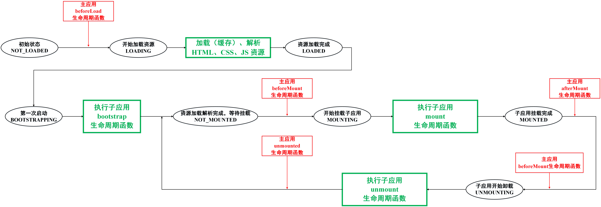

# 微前端运行层原理

> 基于 qiankun、gargish 实现方式

## 1. 背景

## 2. 技术方案与应用场景

微前端的实现方案有挺多，比如说：

1. qiankun，garfish，icestark 自己实现 JS 及样式隔离；
2. emp，webpack5 module federation（联邦模块）方案；
3. iframe，webcomponent 等方案；

主要应用场景分为两类：

1.  单实例：当前页面只存在一个子应用，qiankun，garfish 比较适用；
2. 多实例：当前页面同时存在多个子应用，可以使用浏览器原生隔离方案，比如 iframe 或 webcomponent；

## 3. 运行层原理

### 3.1 主子应用生命周期与状态



#### 3.1.1  主应用生命周期函数

> 内部维护一个 lifeCycle: ILifeCycle 数组用于存储主应用的生命周期函数

```typescript
// 主应用生命周期函数
export interface ILifeCycle {
  beforeLoad?: LifeCycle | LifeCycle[]; // 加载资源前
  beforeMount?: LifeCycle | LifeCycle[]; // 挂载子应用前
  afterMount?: LifeCycle | LifeCycle[]; // 挂载子应用完成
  beforeUnmount?: LifeCycle | LifeCycle[]; // 卸载子应用前
  afterUnmount?: LifeCycle | LifeCycle[]; // 卸载子应用完成
}

// lifeCycle 
let lifeCycle: ILifeCycle = {};
export const setLifeCycle = (list: ILifeCycle) => {
  lifeCycle = list;
};
export const getLifeCycle = () => {
  return lifeCycle;
};
```

#### 3.1.2  子应用生命周期状态

- 未加载：初始化状态
- 开始加载资源
- 已完成加载解析资源
- 第一次触发：BOOTSTRAPPING
- 子应用等待加载状态：NOT_MOUNTED
- 开始挂载子应用
- 子应用挂载完成
- 子应用开始卸载：卸载完成转到等待加载状态 NOT_MOUNTED

```typescript
// 子应用生命周期状态
export enum AppStatusEn {
  NOT_LOADED = 'NOT_LOADED', // 子应用初始化的资源未加载状态

  LOADING = 'LOADING', // 开始加载子应用资源
  LOADED = 'LOADED', // 子应用资源加载解析完成

  BOOTSTRAPPING = 'BOOTSTRAPPING', // 子应用首次触发加载
  NOT_MOUNTED = 'NOT_MOUNTED', // 子应用未挂载

  MOUNTING = 'MOUNTING', // 开始挂载子应用
  MOUNTED = 'MOUNTED', // 子应用挂载完成

  UNMOUNTING = 'UNMOUNTING', // 卸载前
}
```

#### 3.1.3 子应用基本配置

> 内部维护一个 appList:IInternalAppInfo 数组用于存储子应用的信息
>
> 1. 基本配置信息；
> 2. js 沙箱；
> 3. 子应用生命周期函数；

1. 外部子应用注册基本配置（在主应用中注册时使用）

```typescript
// 子应用基本信息配置
export interface IAppInfo {
  name: string; // 子应用名词
  entry: string; // 子应用的资源入口
  activeRule: string; // 在哪些路由下渲染该子应用
  container: string; // 主应用渲染子应用的节点
}
```

2. 主应用内部维护的子应用配置
   - 子应用基本配置
   - 子应用生命周期状态
   - js 沙箱
   - 子应用的生命周期函数
     - bootstrap
     - mount
     - unmount

```typescript
// 内部维护的子应用状态
export interface IInternalAppInfo extends IAppInfo {
  status: AppStatusEn; // 子应用生命周期状态
  proxy?: ProxySandbox; // js 沙箱

  // 通常是在子应用中注册
  bootstrap?: LifeCycle;
  mount?: LifeCycle;
  unmount?: LifeCycle;
}
```

### ***3.2 子应用注册-registerMicroApps***

> 微前端对外暴露的第一个接口，用于注册主子应用信息
>
> 1. 子应用基本配置信息，不包括：子应用生命周期状态、js 沙箱、子应用的生命周期函数
> 2. 主应用生命周期函数；

```typescript
/**
 *
 * @param appList 子应用基本信息列表
 * @param lifeCycle 主应用生命周期函数
 */
export const registerMicroApps = (
  appList: IAppInfo[],
  lifeCycle?: ILifeCycle
) => {
  setAppList(appList);
  lifeCycle && setLifeCycle(lifeCycle);
};
```

### 3.3 路由劫持

#### 3.3.1 监听路由变化

> 1. 重写 pushState 以及 replaceState 方法;
>    - 保证路由发生变化的时候，执行路由切换事件 reRoute
> 2. 监听 popstate 事件
>    - 执行路由切换事件 reRoute
> 3. 劫持 addEventListener、removeEventListener 事件

```typescript
// 保存原有方法
const originalPush = window.history.pushState;
const originalReplace = window.history.replaceState;

const listenRoute = () => {
  // 1. 重写 pushState 以及 replaceState 方法
  window.history.pushState = (...args) => {
    originalPush.apply(this, args);
    args[2] && reRoute(args[2] as string);
  };
  window.history.replaceState = (...args) => {
    originalReplace.apply(window.history, args);
    args[2] && reRoute(args[2] as string);
  };

  // 2. 监听 popstate 事件
  window.addEventListener('popstate', (e) => reRoute(location.pathname, e));

  // 3. 劫持 addEventListener、removeEventListener 事件
  const originalAddEventListener = window.addEventListener;
  const originalRemoveEventListener = window.addEventListener;
  window.addEventListener = function (name: string, fn: any) {
    if (
      name === 'popstate' &&
      !capturedPopstateListeners.find((item) => item === fn)
    ) {
      // 注册事件
      capturedPopstateListeners.push(fn);
      return;
    }

    // 一般的处理
    return originalAddEventListener(name, fn);
  };
  window.addEventListener = function (name: string, fn: any) {
    if (name === 'popstate') {
      // 解绑事件
      capturedPopstateListeners = capturedPopstateListeners.filter(
        (item) => item !== fn
      );
      return;
    }

    // 一般的处理
    return originalRemoveEventListener(name, fn);
  };
};
```

#### 3.3.2 路由切换事件

> 一旦路由发生切换，则表明需要考虑子应用切换；
>
> 事实上，路由切换并不一定意味着子应用切换，如果没发生子应用切换，应该什么都不做

```typescript
let lastUrl: string | null = null;
let lastApp: IInternalAppInfo | null = null;


// 路由切换统一处理
export const reRoute = async (
  curPathname: string = location.pathname,
  event?: PopStateEvent
) => {
  if (curPathname !== lastUrl) {
    const { activeApp, unmountApp } = getAppListStatus(); // 找出将要激活的子应用、将要卸载的子应用
    // 1. 先卸载已有的子应用
    unmountApp && (await runUnmounted(unmountApp));

    if (activeApp && activeApp !== lastApp) {
      // 2. 挂载激活的子应用：
      // 2.1 第一次挂载
      activeApp?.status === AppStatusEn.NOT_LOADED &&
        (await runBeforeLoad(activeApp)) &&
        (await runBeforeLoad(activeApp));
      // 2.2 后续再次挂载
      await runMounted(activeApp);

      lastUrl = curPathname;
      lastApp = activeApp;
    }
  }

  // 等到子应用加载卸载处理完成，执行 popstate 事件劫持到的事件函数
  event &&
    capturedPopstateListeners.forEach((listener) => {
      listener.apply(event);
    });
};
```

### 3.4 子应用静态资源加载与解析

#### 3.4.1 利用 import-html-entry实现

> import-html-entry 自带缓存功能
>
> 1. 内联样式保持不变，外链样式在请求到样式资源后在原来的位置使用内联样式替换；
> 2. 内联 js 脚本，外链 js 脚本在原来的 HTML 文档中注释掉，手动（new Function(jsCode)）统一执行；
>    - 提取子应用注册的生命周期函数：bootstrap、mount、unmount

```typescript
import { IInternalAppInfo } from '../types';
import { importEntry } from 'import-html-entry';
import { ProxySandbox } from './ProxySandbox';

/**
 * 使用 import-html-entry 库加载解析静态资源
 * 1. 加载 html 资源，并解析为 dom 树对象；
 * 2. 从 dom 树对象中解析 css 资源地址，并加载；
 * 3. 从 dom 树对象中解析 js 资源，并加载解析出子应用生命周期函数
 */
export const loadHTML = async (app: IInternalAppInfo) => {
  const { entry } = app;

  // a. 根据 entry 开始加载解析静态资源
  // template：处理 HTML 文本未 HTML 文档对象
  // getExternalStyleSheets：fetch CSS 文件
  // getExternalScripts：fetch JS 文件
  const { template, getExternalScripts, getExternalStyleSheets } =
    await importEntry(entry);

  // b. 处理 css 样式资源与 js 资源
  // b.1 加载 css 外联样式，并将其以内联样式注入到 template 文档对象中
  const cssCodeArr = await getExternalStyleSheets();
  app.htmlTemplate = cssCodeArr.reduce((pre, cssCode, index) => {
    return dynamicAppendStyle(cssCode, index, pre);
  }, template);

  // b.2 加载 js 外联，并提取子应用的生命周期函数
  const jsCode = await getExternalScripts();
  jsCode.forEach((script) => {
    const lifeCycle = runJS(script, app);
    if (lifeCycle) {
      app.bootstrap = lifeCycle.bootstrap;
      app.mount = lifeCycle.mount;
      app.unmount = lifeCycle.unmount;
    }
  });

  return app;
};

/**
 * 替换 html 文本中的外联样式未内联样式
 */
const dynamicAppendStyle = (
  cssCode: string,
  index: number,
  template: string
) => {
  return template;
};

/**
 * 1. 激活当前子应用 js 沙箱
 * 2. 返回子应用注册的生命周期函数：bootstrap、mount、unmount
 */
const runJS = (value: string, app: IInternalAppInfo) => {
  if (!app.proxy) {
    app.proxy = new ProxySandbox();
    // @ts-ignore
    window.__CURRENT_PROXY__ = app.proxy.proxy;
  }
  app.proxy.active();
  const code = `
    return (window => {
      ${value}
      return window['${app.name}']
    })(window.__CURRENT_PROXY__)
  `;
  return new Function(code)();
};
```

#### 3.4.1 实现 import-html-entry 底层原理

> 只负责加载 HTML 资源，并从中解析出 link链接、内联js脚本 和 外链js链接
>
> 不会去主动执行 js 脚本；

1. 加载静态资源：HTML、CSS、JS

```typescript
const links: string[] = []; // 样式资源外链地址
const scripts: string[] = []; // js 脚本外链地址
const inlineScript: string[] = []; // js 脚本内联内容

export const loadHTML = async (app: IInternalAppInfo) => {
  const { entry, name } = app;

  // 1. 加载 html 资源，并解析为 HTML 文档输
  const htmlFile = await fetchResource(entry, name);
  const fakeContainer = document.createElement('div');
  fakeContainer.innerHTML = htmlFile;

  // 2. 从 HTML 文档树中提取 js 资源 和 css-link 资源
  const { scripts, links, inlineScript } = parseHTML(fakeContainer, app);

  // 2.1 加载所有的 link 资源
  await Promise.all(links.map((link) => fetchResource(link, name)));

  // 2.2 加载所有的 js 资源，并准备执行
  const jsCode = (
    await Promise.all(scripts.map((script) => fetchResource(script, name)))
  ).concat(inlineScript);

  return app;
};
```

2. 递归解析 HTML 资源

```typescript
/**
 * 递归遍历子应用的 dom 树：
 * 从 dom 树中捞出 link、script、img 标签
 */
export const parseHTML = (root: HTMLElement, app: IInternalAppInfo) => {
  // parent.children - HTMLCollection
  const children = Array.from(root.children) as HTMLElement[];
  children.length && children.forEach((item) => parseHTML(item, app));

  for (const dom of children) {
    if (/^(link)$/i.test(dom.tagName)) {
      const data = parseLink(dom, root, app);
      data && links.push(data);
    } else if (/^(script)$/i.test(dom.tagName)) {
      const data = parseScript(dom, root, app);
      data.text && inlineScript.push(data.text);
      data.url && scripts.push(data.url);
    } else if (/^(img)$/i.test(dom.tagName) && dom.hasAttribute('src')) {
      // 处理图片资源地址的路径问题
      dom.setAttribute(
        'src',
        getCompletionURL(dom.getAttribute('src'), app.entry)!
      );
    }
  }

  return { scripts, links, inlineScript };
};
```

3. 提取外链 css、js 地址

```typescript

/**
 * 处理 script 节点
 * 内联脚本：返回脚本字符串
 * 外链脚本：返回脚本url
 */
const parseScript = (
  scriptDom: HTMLElement,
  rootDom: HTMLElement,
  app: IInternalAppInfo
) => {
  const scriptSrc = scriptDom.getAttribute('src');
  rootDom.replaceChild(
    document.createComment(
      `${!scriptSrc ? 'inline' : ''} script replaced by micro`
    ),
    scriptDom
  );
  // 返回 script 脚本内容 或者 脚本地址
  return {
    url: getCompletionURL(scriptSrc, app.entry),
    text: scriptDom.innerHTML,
  };
};

/**
 * 返回 style 样式资源 url
 */
const parseLink = (
  linkDom: HTMLElement,
  rootDom: HTMLElement,
  app: IInternalAppInfo
) => {
  /**
   * 外联样式：<link href="/css/main_240f9.css" rel="stylesheet">
   *
   */
  const rel = linkDom.getAttribute('rel'); // 样式
  const href = linkDom.getAttribute('href');
  if (rel === 'stylesheet' && href) {
    // 如果是外部样式资源
    rootDom.replaceChild(
      document.createComment(`link replaced by micro`), // 替换为注释
      linkDom
    );
    return getCompletionURL(href, app.entry);
  } else if (href) {
    // 其他资源处理一下 url
    linkDom.setAttribute('href', getCompletionURL(href, app.entry)!);
  }
};

```

### 3.5 js 沙箱

> 1. 每个子应用都有一个独立的 js 沙箱
> 2. 组成
>    - proxy 代理对象
>    - running 当前是否激活标识

```typescript
type FakeWindow = Window & Record<PropertyKey, any>;

export class ProxySandbox {
  private proxy: FakeWindow;
  private running = false;
  constructor() {
    const _this = this;

    // 创建个假的 window
    const fakeWindow = Object.create(null);

    // 进行代理
    this.proxy = new Proxy(fakeWindow, {
      set: (target: FakeWindow, key: string, value: any) => {
        // 如果当前沙箱在运行，就直接把值设置到 fakeWindow 上
        if (_this.running) {
          target[key] = value;
        }
        return true;
      },
      get(target: FakeWindow, key: string): any {
        // 避免用户逃逸： 
        // avoid who using window.window or window.self or window.globalThis 
        // to escape the sandbox environment to touch the really window
        switch (key) {
          case 'window':
          case 'self':
          case 'globalThis':
            return _this.proxy;
        }
        // 假如属性不存在 fakeWindow 上，但是存在于 window 上
        // 从 window 上取值
        if (!target.hasOwnProperty(key) && window.hasOwnProperty(key)) {
          let value = window[key as keyof Window];
          if (typeof value === 'function') {
            value = value.bind(window);
          }
          return value;
        }
        return target[key];
      },
      has(target: FakeWindow, key: string) {
        return key in target || key in window;
      },
    });
  }
  // 激活沙箱
  active() {
    this.running = true;
  }
  // 失活沙箱
  inactive() {
    this.running = false;
  }
}
```

### 3.5 应用（主子、兄弟子应用）通信


